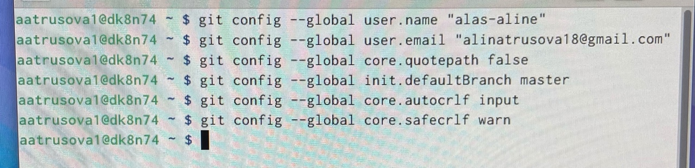

---
## Front matter
title: "Отчёт по лабораторной работе №2"
subtitle: "Дисциплина: архитектура компьютера"
author: "Трусова Алина Александровна"

## Generic otions
lang: ru-RU
toc-title: "Содержание"

## Bibliography
bibliography: bib/cite.bib
csl: pandoc/csl/gost-r-7-0-5-2008-numeric.csl

## Pdf output format
toc: true # Table of contents
toc-depth: 2
lof: true # List of figures
lot: true # List of tables
fontsize: 12pt
linestretch: 1.5
papersize: a4
documentclass: scrreprt
## I18n polyglossia
polyglossia-lang:
  name: russian
  options:
	- spelling=modern
	- babelshorthands=true
polyglossia-otherlangs:
  name: english
## I18n babel
babel-lang: russian
babel-otherlangs: english
## Fonts
mainfont: IBM Plex Serif
romanfont: IBM Plex Serif
sansfont: IBM Plex Sans
monofont: IBM Plex Mono
mathfont: STIX Two Math
mainfontoptions: Ligatures=Common,Ligatures=TeX,Scale=0.94
romanfontoptions: Ligatures=Common,Ligatures=TeX,Scale=0.94
sansfontoptions: Ligatures=Common,Ligatures=TeX,Scale=MatchLowercase,Scale=0.94
monofontoptions: Scale=MatchLowercase,Scale=0.94,FakeStretch=0.9
mathfontoptions:
## Biblatex
biblatex: true
biblio-style: "gost-numeric"
biblatexoptions:
  - parentracker=true
  - backend=biber
  - hyperref=auto
  - language=auto
  - autolang=other*
  - citestyle=gost-numeric
## Pandoc-crossref LaTeX customization
figureTitle: "Рис."
tableTitle: "Таблица"
listingTitle: "Листинг"
lofTitle: "Список иллюстраций"
lotTitle: "Список таблиц"
lolTitle: "Листинги"
## Misc options
indent: true
header-includes:
  - \usepackage{indentfirst}
  - \usepackage{float} # keep figures where there are in the text
  - \floatplacement{figure}{H} # keep figures where there are in the text
---

# Цель работы

Изучение идеологии и применения средств контроля версий; приобретение практических навыков по работе с системой git.

# Задание

1. Базовая настройка Git.
2. Создание SSH-ключа.
3. Создание рабочего пространства и репозитория курса на основе шаблона.
4. Создание репозитория курса на основе шаблона.
5. Настройка каталога курса.
6. Задание для самостоятельной работы.

# Теоретическое введение

Системы котроля версия (Version Control System, VCS) применяются при работе нескольких человек над одним проектом. Обычно основное дерево проекта хранится в локальном или удалённом репозитории, к которому настроен доступ для участников проекта. При внесении изменений в содержание проекта система контроля версий позволяет их фиксировать, совмещать изменения, произведённые разными участниками проекта, производить откат к любой более ранней версии проекта, если это требуется. В классических системах контроля версий используется централизованная модель, предполагающая наличие единого репозитория для хранения файлов. Выполнение большинства функций по управлению версиями осуществляется специальным сервером. Участник проекта (пользователь) перед началом работы посредством определённых команд получает нужную ему версию файлов. После внесения измениний пользователь размещает новую версию в хранилище. При этом предыдущие версии не удаляются из центрального хранилища и к ним можно вернуться в любой момент. Сервер может не сохранять полную версию изменённых файлов, а производить так называемую дельта-компрессию - сохранять только изменения между последовательными версиями, что позволяет уменьшить объём хранимых данных. Системы контроля версий поддерживают возможность отслеживания и разрешения конфликтов, которые могут возникнуть при работе нескольких человек над одним файлом. Можно объединять изменения, сделанные разными участниками, вручную выбрать нужную версию, отменить изменения вовсе или заблокировать файлы для изменения. В зависимости от настроек блокировка не позволяет другим пользваотелям получить рабочую копию или препятствует изменению рабочей копии файла средствами системы ОС, обеспечивая таким образом привелегированный доступ только одному пользователю, работающему с файлом. Системы контроля версий также могутобеспечивать дополнительные, более гибкие функциональные возможности. Например, они могут поддерживать работу с несколькими версиями одного файла, сохраняя общую историю изменений до точки ветвления версий и собственные истории изменений каждой ветви. Обычно доступна информация о том, кто из участников, когда и какие изменения вносил. Обычно такого рода информация хранится в журнале изменений, доступ к которому можно ограничить. В отличие от классических, в распределённых системах контроля версий центральный репозиторий не является обязательным. среди классических VCS наиболее известны CVS, Subversion, а среди распредлённых - Git, Bazaar, Mercurial. Принципы их работы схожи, отличаются они в основном синтаксисом используемых в работе команд.
Система контроля версий Git представляет собой набор программ командной строки. Доступ к ним можно получить из терминала посредством команды git с различными опциями. Благодаря тому, что Git является распределённой системой контроля версий, резервную копию локального хранилища можно сделать простым копирование и архивацией.
Работа пользователя со своей веткой начинается с проверки и получения изменений из центрального репозитория (при этом в локальное дерево до начала этой процедуры не должно было вноситься изменений). Затем можно вносить изменения в локальном дереве и\или ветки. После завершения внесения какого-то изменения в файлы и\или каталоги проекта необходимо разместить их в центральном репозитории.

# Выполнение лабораторной работы

## Базовая настройка GitHub

Предварительная настройка Git. Указала имя, email владельца. Настроила utf-8 в выводе сообщений git. Начальную ветку назвала master. Ввела параметры autocrlf, safecrlf (рис. [-@fig:001]).

{#fig:001 width=70%}

## Создание SSH-ключа

Создала открытый ключ для идентификации на сервере репозиториев (рис. [-@fig:002]).

{#fig:002 width=70%}

Копирую сгенерированные ключ и добавляю его на GitHub (рис. [-@fig:003]).

{#fig:003 width=70%}

## Создание рабочего пространства и репозитория курса на основе шаблона

Создала каталог и иерархическую цепочку для предмета "Архитектура компьютера" с помощью mkdir (рис. [-@fig:004]).

{#fig:004 width=70%}

## Создание репозитория курса на основе шаблона

На основе шаблона я задала имя репозитория как study_2024-2025_arh-pc и создала сам репозиторий.

Я перешла в ранее созданный каталог и с помощью clone клонировала в него этот репозиторий (рис. [-@fig:005]).

{#fig:005 width=70%}

Я перешла в каталог курса, удалила ненужные файлы и создала новые по шаблону с помощью echo (рис. [-@fig:006]).

{#fig:006 width=70%}

Изменения отобразились на сайте (рис. [-@fig:007]).

{#fig:007 width=70%}

##Задание для самостоятельной работы

Я перешла в каталог labs, его подкаталог lab02 и добавила отчёт о выполнении лабораторной работы с помощью touch (рис. [-@fig:008]).

{#fig:008 width=70%}

Добавила ЛР№1 в соответствующий каталог (рис. [-@fig:009]).

{#fig:009 width=70%}

# Выводы

Я изучила идеологию и применение средств контроля версий и приобрела практические навыки по работе с системой git.

# Список литературы{.unnumbered}

1. [Архитектура ЭВМ](https://esystem.rudn.ru/pluginfile.php/1584622/mod_resource/content/1/%D0%9B%D0%B0%D0%B1%D0%BE%D1%80%D0%B0%D1%82%D0%BE%D1%80%D0%BD%D0%B0%D1%8F%20%D1%80%D0%B0%D0%B1%D0%BE%D1%82%D0%B0%20%E2%84%963.pdf)
:::
