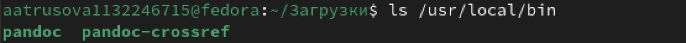

---
## Front matter
title: "Отчёт по лабораторной работе №3"
subtitle: "Дисциплина: архитектура компьютера"
author: "Трусова Алина Александровна"

## Generic otions
lang: ru-RU
toc-title: "Содержание"

## Bibliography
bibliography: bib/cite.bib
csl: pandoc/csl/gost-r-7-0-5-2008-numeric.csl

## Pdf output format
toc: true # Table of contents
toc-depth: 2
lof: true # List of figures
lot: true # List of tables
fontsize: 12pt
linestretch: 1.5
papersize: a4
documentclass: scrreprt
## I18n polyglossia
polyglossia-lang:
  name: russian
  options:
	- spelling=modern
	- babelshorthands=true
polyglossia-otherlangs:
  name: english
## I18n babel
babel-lang: russian
babel-otherlangs: english
## Fonts
mainfont: IBM Plex Serif
romanfont: IBM Plex Serif
sansfont: IBM Plex Sans
monofont: IBM Plex Mono
mathfont: STIX Two Math
mainfontoptions: Ligatures=Common,Ligatures=TeX,Scale=0.94
romanfontoptions: Ligatures=Common,Ligatures=TeX,Scale=0.94
sansfontoptions: Ligatures=Common,Ligatures=TeX,Scale=MatchLowercase,Scale=0.94
monofontoptions: Scale=MatchLowercase,Scale=0.94,FakeStretch=0.9
mathfontoptions:
## Biblatex
biblatex: true
biblio-style: "gost-numeric"
biblatexoptions:
  - parentracker=true
  - backend=biber
  - hyperref=auto
  - language=auto
  - autolang=other*
  - citestyle=gost-numeric
## Pandoc-crossref LaTeX customization
figureTitle: "Рис."
tableTitle: "Таблица"
listingTitle: "Листинг"
lofTitle: "Список иллюстраций"
lotTitle: "Список таблиц"
lolTitle: "Листинги"
## Misc options
indent: true
header-includes:
  - \usepackage{indentfirst}
  - \usepackage{float} # keep figures where there are in the text
  - \floatplacement{figure}{H} # keep figures where there are in the text
---

# Цель работы

Целью данной лабораторной работы является освоение процедуры оформления отчётов с помощью легковесного языка разметки Markdown.

# Задание

1. Установка необходимого ПО
2. Заполнение отчёта по выполнению лабораторной работы №3 с помощью языка разметки Markdown
3. Задание для самостоятельной работы

# Теоретическое введение

Markdown - легковесный язык разметки, созданный с целью обозначения форматирования в простом тексте с максимальным сохранением его читаемости человеком и пригодный для машинного преобразования в языки для продвинутых публикаций.
Внутритекстовые формулы делаются аналагично формулам LaTeX.
В Markdown вставить изображение в документ можно с помощью непосредственного указания адреса изображения.
Синтаксис Markdown для встроенной ссылки состоит из части [link text], представляющей текст гиперссылки, и части (file-name.md) - URL-адреса или имени файла, на который даётся ссылка.
Markdown поддерживает как встраивание фрагментов кода в предложение, так и их размещение между предложениями в виде отдельных ограждённых блоков. Ограждённые блоки кода - это простой способ выделить синтаксис для фрагментов кода.
# Выполнение лабораторной работы

## Установка необходимого ПО

### Установка TexLive

Скачала TexLive с официального сайта. Распаковываю архив (рис. [-@fig:001]).

{#fig:001 width=70%}

Перехожу в распакованную папку с помощью cd. Запускаю скрипт install-tl-* (рис. [-@fig:002]).

{#fig:002 width=70%}

Добавляю /usr/local/texlive/2024/bin/x86_64-linux в свой PATH для текущей и будущих сессий (рис. [-@fig:003]).

{#fig:003 width=70%}

## Установка pandoc и pandoc-crossref

Скачиваю архивы pandoc и pandoc-crossref (рис. [-@fig:004]).

{#fig:004 width=70%}

Распаковываю скачанные архивы (рис. [-@fig:005]).

{#fig:005 width=70%}

Копирую файлы pandoc и pandoc-crossref в каталог /usr/local/bin/ с правами root с помощью sudo (рис. [-@fig:006]).

{#fig:006 width=70%}

Проверяю корректность выполненных действий (рис. [-@fig:007]).

{#fig:007 width=70%}

## Заполнение отчёта по выполнению лабораторной работы с помощью языка разметки Markdown

Перехожу в каталог курса, сформированный при выполнении прошлой лабораторной работы и обновляю локальный репозиторий, скачав изменения из удалённого репозитория с помощью команды git pull (рис. [-@fig:008]).

{#fig:008 width=70%}

Компилирую шаблон с использованием Makefile, вводя команду make (рис. [-@fig:009]).

{#fig:009 width=70%}

Проверяю правильность полученных файлов (рис. [-@fig:010]).

{#fig:010 width=70%}

Удалила полученные файлы с помощью make clean и проверила правильность выполнения команды (рис. [-@fig:011]).

{#fig:011 width=70%}

Открыла файл report.md с помощью gedit (рис. [-@fig:012]) (рис. [-@fig:013]).

{#fig:012 width=70%}

{#fig:013 width=70%}

Заполнила отчёт (рис. [-@fig:014]).

{#fig:014 width=70%}
# Выводы

В результате выполнения данной лабораторной работы я освоила процедуры оформления отчётов с помощью легковесного языка разметки Markdown.

# Список литературы{.unnumbered}
1. 
