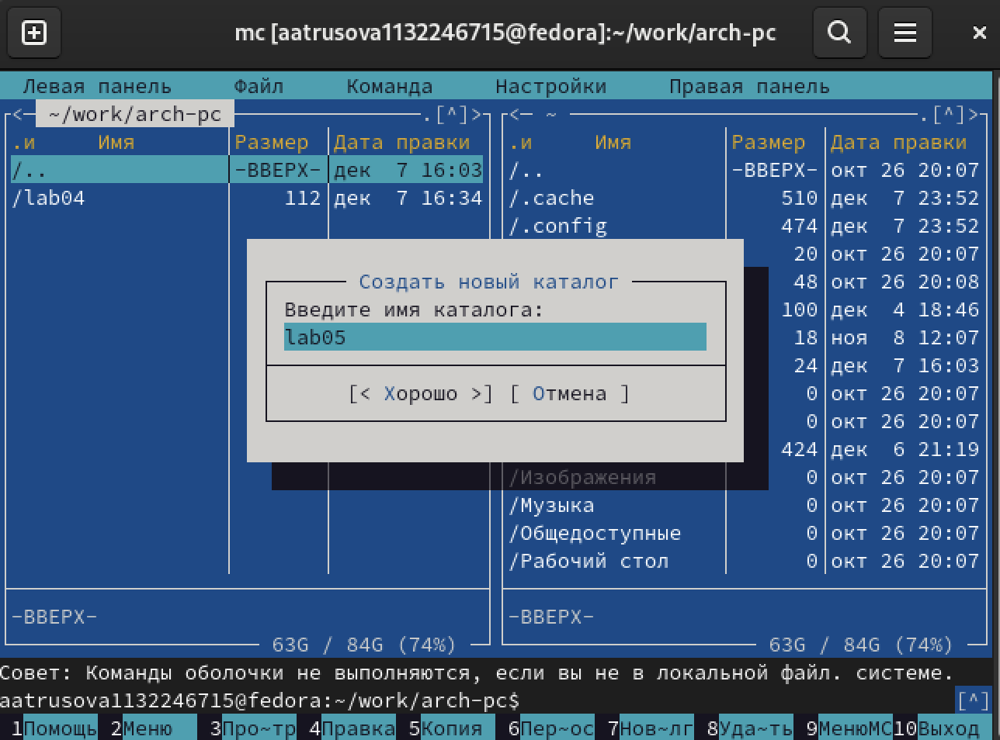

---
## Front matter
title: "Отчёт по лабораторной работе №5"
subtitle: "Дисциплина: архитектура компьютера"
author: "Трусова Алина Александровна"

## Generic otions
lang: ru-RU
toc-title: "Содержание"

## Bibliography
bibliography: bib/cite.bib
csl: pandoc/csl/gost-r-7-0-5-2008-numeric.csl

## Pdf output format
toc: true # Table of contents
toc-depth: 2
lof: true # List of figures
lot: true # List of tables
fontsize: 12pt
linestretch: 1.5
papersize: a4
documentclass: scrreprt
## I18n polyglossia
polyglossia-lang:
  name: russian
  options:
	- spelling=modern
	- babelshorthands=true
polyglossia-otherlangs:
  name: english
## I18n babel
babel-lang: russian
babel-otherlangs: english
## Fonts
mainfont: IBM Plex Serif
romanfont: IBM Plex Serif
sansfont: IBM Plex Sans
monofont: IBM Plex Mono
mathfont: STIX Two Math
mainfontoptions: Ligatures=Common,Ligatures=TeX,Scale=0.94
romanfontoptions: Ligatures=Common,Ligatures=TeX,Scale=0.94
sansfontoptions: Ligatures=Common,Ligatures=TeX,Scale=MatchLowercase,Scale=0.94
monofontoptions: Scale=MatchLowercase,Scale=0.94,FakeStretch=0.9
mathfontoptions:
## Biblatex
biblatex: true
biblio-style: "gost-numeric"
biblatexoptions:
  - parentracker=true
  - backend=biber
  - hyperref=auto
  - language=auto
  - autolang=other*
  - citestyle=gost-numeric
## Pandoc-crossref LaTeX customization
figureTitle: "Рис."
tableTitle: "Таблица"
listingTitle: "Листинг"
lofTitle: "Список иллюстраций"
lotTitle: "Список таблиц"
lolTitle: "Листинги"
## Misc options
indent: true
header-includes:
  - \usepackage{indentfirst}
  - \usepackage{float} # keep figures where there are in the text
  - \floatplacement{figure}{H} # keep figures where there are in the text
---

# Цель работы

Целью данной лабораторной работы является приобретение практических навыков работы в Midnight Commander, освоение инструкций языка ассемблера mov и int.

# Задание

1. Основы работы с mc
2. Структура программы на языке ассемблера NASM
3. Подключение внешнего файла
4. Выполнение заданий для самостоятельной работы

# Теоретическое введение

Midnight Commander (или просто mc) — это программа, которая позволяет просматривать структуру каталогов и выполнять основные операции по управлению файловой системой, т.е. mc является файловым менеджером. Midnight Commander позволяет сделать работу с файлами более удобной и наглядной. Программа на языке ассемблера NASM, как правило, состоит из трёх секций: секция кода программы (SECTION .text), секция инициированных (известных во время компиляции) данных (SECTION .data) и секция неинициализированных данных (тех, под которые во время компиляции только отводится память, а значение присваивается в ходе выполнения программы) (SECTION .bss). Для объявления инициированных данных в секции .data используются директивы DB, DW, DD, DQ и DT, которые резервируют память и указывают, какие значения должны храниться в этой памяти: - DB (define byte) — определяет переменную размером в 1 байт; - DW (define word) — определяет переменную размеров в 2 байта (слово); - DD (define double word) — определяет переменную размером в 4 байта (двойное слово); - DQ (define quad word) — определяет переменную размером в 8 байт (учетве- рённое слово); - DT (define ten bytes) — определяет переменную размером в 10 байт. Директивы используются для объявления простых переменных и для объявления массивов. Для определения строк принято использовать директиву DB в связи с особенностями хранения данных в оперативной памяти. Инструкция языка ассемблера mov предназначена для дублирования данных источника в приёмнике.
mov dst,src
Здесь операнд dst — приёмник, а src — источник. В качестве операнда могут выступать регистры (register), ячейки памяти (memory) и непосредственные значения (const). Инструкция языка ассемблера intпредназначена для вызова прерывания с указанным номером.
int n
Здесь n — номер прерывания, принадлежащий диапазону 0–255. При программировании в Linux с использованием вызовов ядра sys_calls n=80h (принято задавать в шестнадцатеричной системе счисления).

# Выполнение лабораторной работы

## Работа с mc и программа на языке ассемблера NASM

Открыла Midnight commander c помощью mc (рис. [-@fig:001]).

{#fig:001 width=70%}

С помощью стрелочек и enter перешла в каталог ~/work/arch-pc созданный при выполнении лабораторной работы №4 (рис. [-@fig:002]).

{#fig:002 width=70%}

С помощью функциональной клавиши F7 создала папку lab05 и перешла в него (рис. [-@fig:003]).

{#fig:003 width=70%}

Пользуясь строкой ввода и командой touch, создала файл lab5-1.asm (рис. [-@fig:004]).

{#fig:004 width=70%}

С помощью функциональной клавиши F4 открыла файл lab5-1.asm для редактирования во встроенном редакторе mcedit, ввела текст программы, сохранила изменения и закрыла файл  (рис. [-@fig:005]).

{#fig:005 width=70%}

С помощью функциональной клавиши F3 открыла файл lab5-1.asm для просмотра. Файл содержит текст программы (рис. [-@fig:006]).

{#fig:006 width=70%}

Оттранслировала текст программы lab5-1.asm в объектный файл, выполнила компоновку объектного файла и запустила получившийся исполняемый файл . На запрос ввела своё ФИО (рис. [-@fig:007]).

{#fig:007 width=70%}

## Покдлючением внешнего файла

Скачала файл in_out.asm со страницы курса в ТУИС. Он переместился в каталог Загрузки. В одной из панелей mc открыла каталог с файлом lab5-1.asm, в другой — каталог со скаченным файлом in_out.asm (рис. [-@fig:008]).

{#fig:008 width=70%}

Скопировала файл in_out.asm в каталог с файлом lab5-1.asm с помощью функциональной клавиши F5 (рис. [-@fig:009]).

{#fig:009 width=70%}

С помощью функциональной клавиши F6 создала копию файла lab5-1.asm с именем lab5-2.asm (рис. [-@fig:010]).

{#fig:010 width=70%}

Исправила текст программы в файле lab5-2.asm с использованием подпрограмм из внешнего файла in_out.asm (рис. [-@fig:011]).

{#fig:011 width=70%}

Создала исполняемый файл и проверила его работу (рис. [-@fig:012]).

{#fig:012 width=70%}

В файле lab5-2.asm заменила подпрограмму sprintLF на sprint (рис. [-@fig:013]).

{#fig:013 width=70%}

Создала исполняемый файл и проверила его работу. Исправленный файл не переносит строку после запроса строки (рис. [-@fig:014]).

{#fig:014 width=70%}

## Задание для самостоятельной работы

Создала копию файла lab5-1.asm с именем lab5-11.asm (рис. [-@fig:015]).

{#fig:015 width=70%}

Внесла изменения в программу так, чтобы она работала по следующему алгоритму: 1) вывести приглашение типа“Введите строку:”; 2) ввести строку с клавиатуры; 3) вывести введённую строку на экран (рис. [-@fig:016]).

{#fig:016 width=70%}

Получила исполняемый файл и проверила его работу. На приглашение ввести строку ввела свою фамилию (рис. [-@fig:017]).

{#fig:017 width=70%}

Создала копию файла lab5-2.asm. Исправила текст программы с использованием подпрограмм из внешнего файла in_out.asm так, чтобы она работала по следующему алгоритму: 1) вывести приглашение типа“Введите строку:”; 2) ввести строку с клавиатуры; 3) вывести введённую строку на экран (рис. [-@fig:018]).

{#fig:018 width=70%}

Создала исполняемый файл и проверила его работу (рис. [-@fig:019]).

{#fig:019 width=70%}

# Выводы

Я приобрела практические навыки работы в Midnight Commander, освоила инструкции языка ассемблера mov и int.

# Список литературы{.unnumbered}

1. https://esystem.rudn.ru/pluginfile.php/2089085/mod_resource/content/0/Лабораторная%20работа%20№5.%20Основы%20работы%20с%20Midnight%20Commander%20%28%29.%20Структура%20программы%20на%20языке%20ассемблера%20NASM.%20Системные%20вызовы%20в%20ОС%20GNU%20Linux.pdf
