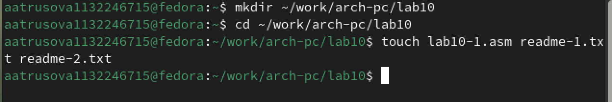
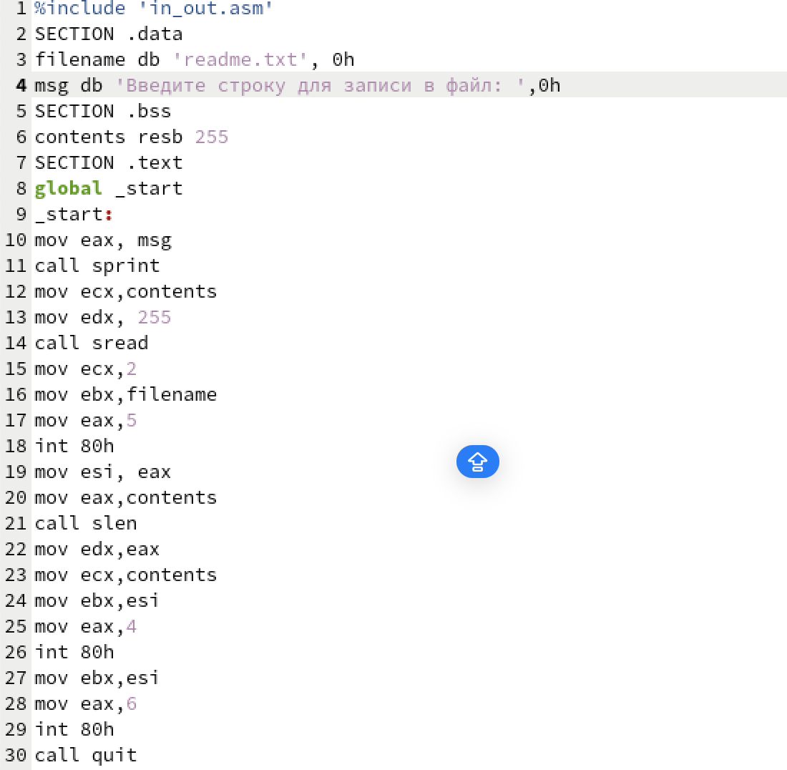
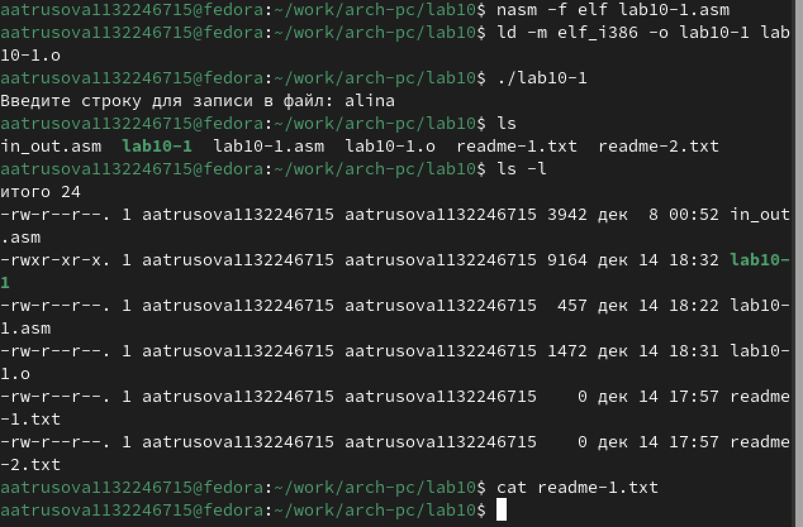
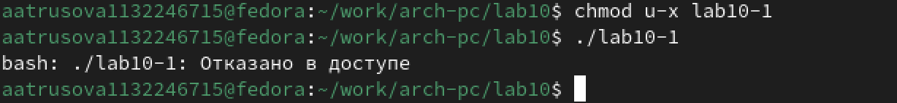
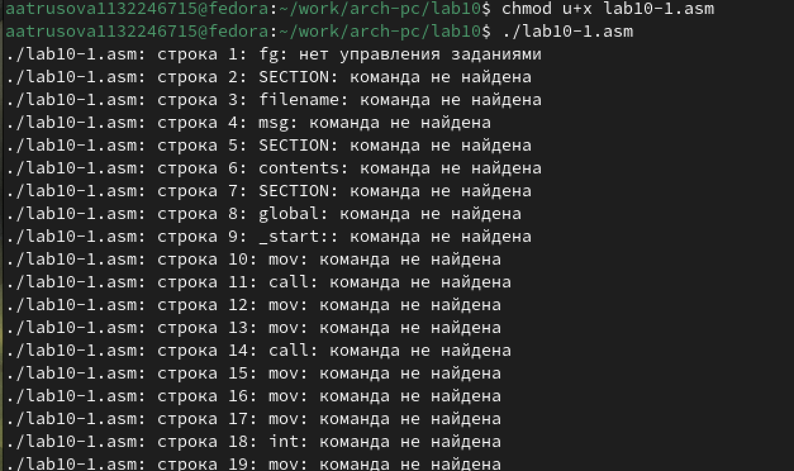
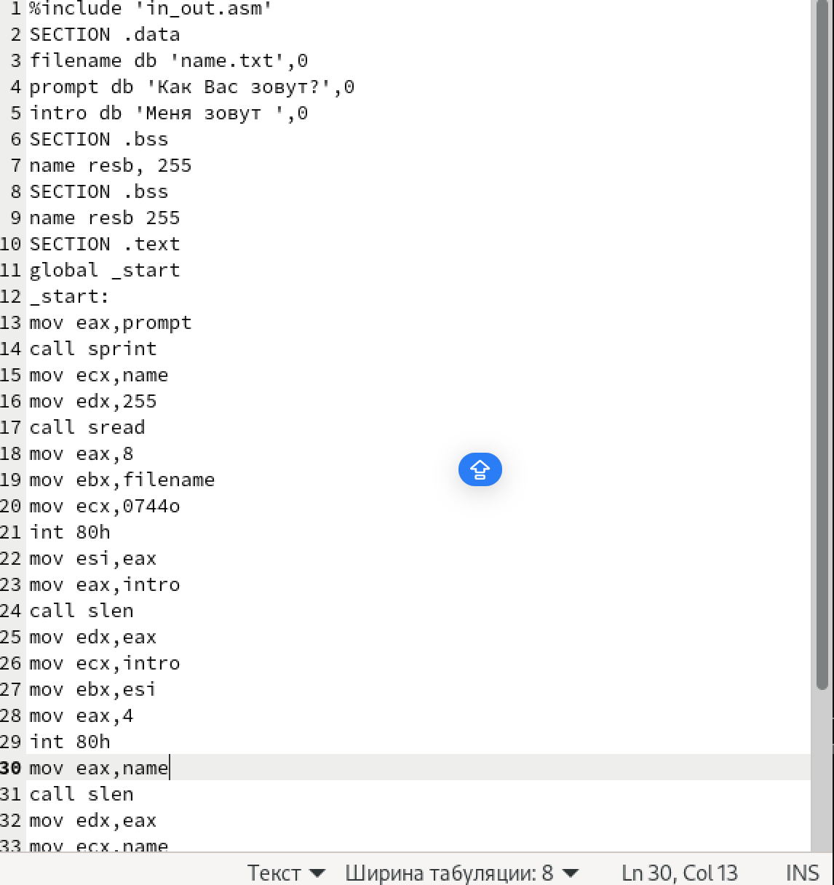

---
## Front matter
title: "Отчет по лабораторной работе №10
subtitle: "Дисциплина: Архитектура компьютера"
author: "Трусова Алина Александровна"

## Generic otions
lang: ru-RU
toc-title: "Содержание"

## Bibliography
bibliography: bib/cite.bib
csl: pandoc/csl/gost-r-7-0-5-2008-numeric.csl

## Pdf output format
toc: true # Table of contents
toc-depth: 2
lof: true # List of figures
lot: true # List of tables
fontsize: 12pt
linestretch: 1.5
papersize: a4
documentclass: scrreprt
## I18n polyglossia
polyglossia-lang:
  name: russian
  options:
	- spelling=modern
	- babelshorthands=true
polyglossia-otherlangs:
  name: english
## I18n babel
babel-lang: russian
babel-otherlangs: english
## Fonts
mainfont: IBM Plex Serif
romanfont: IBM Plex Serif
sansfont: IBM Plex Sans
monofont: IBM Plex Mono
mathfont: STIX Two Math
mainfontoptions: Ligatures=Common,Ligatures=TeX,Scale=0.94
romanfontoptions: Ligatures=Common,Ligatures=TeX,Scale=0.94
sansfontoptions: Ligatures=Common,Ligatures=TeX,Scale=MatchLowercase,Scale=0.94
monofontoptions: Scale=MatchLowercase,Scale=0.94,FakeStretch=0.9
mathfontoptions:
## Biblatex
biblatex: true
biblio-style: "gost-numeric"
biblatexoptions:
  - parentracker=true
  - backend=biber
  - hyperref=auto
  - language=auto
  - autolang=other*
  - citestyle=gost-numeric
## Pandoc-crossref LaTeX customization
figureTitle: "Рис."
tableTitle: "Таблица"
listingTitle: "Листинг"
lofTitle: "Список иллюстраций"
lotTitle: "Список таблиц"
lolTitle: "Листинги"
## Misc options
indent: true
header-includes:
  - \usepackage{indentfirst}
  - \usepackage{float} # keep figures where there are in the text
  - \floatplacement{figure}{H} # keep figures where there are in the text
---

# Цель работы

Приобретение навыков написания программ для работы с файлами.

# Задание

1. Создание файлов в программах
2. Изменение прав на файлы для разных групп пользователей
3. Выполнение самостоятельных заданий по материалам лабораторной работы.

# Теоретическое введение

ОС GNU/Linux является многопользовательской операционной системой. И для обеспече-
ния защиты данных одного пользователя от действий других пользователей существуют
специальные механизмы разграничения доступа к файлам. Кроме ограничения доступа, дан-
ный механизм позволяет разрешить другим пользователям доступ данным для совместной
работы.

# Выполнение лабораторной работы

Создаю каталог для программ лабораторной работы № 10, перехожу и создаю файлы (рис. -@fig:001).

{#fig:001 width=70%}

Ввожу в созданный файл программу из первого листинга (рис. -@fig:002).

{#fig:002 width=70%}

Запускаю программу, она просит на ввод строку, 
после чего создает текстовый файл с введенной пользователем строкой (рис. -@fig:003).

{#fig:003 width=70%}

Меняю права владельца, запретив исполнять файл, 
после чего система отказывает в исполнении файла(рис. -@fig:004).

{#fig:004 width=70%}

Добавляю к исходному файлу программы права владельцу на исполнение, исполняемый текстовый файл интерпретирует каждую строку как команду, 
так как ни одна из строк не является командой bash, программа абсолютно ничего не делает (рис. -@fig:005).

{#fig:005 width=70%}

## Задание для самостоятельной работы

Пишу программу, транслириую и компилирую. Программа должна выводить приглашение, 
просить ввод с клавиатуры и создавать текстовый файл с указанной в программе строкой и вводом пользователя.
Запускаю программу, проверяю наличие и содержание созданного текстого файла, программа работает корректно (рис. -@fig:006).

{#fig:006 width=70%}

# Выводы

В процессе выполнения лабораторной работы я прибрел навыки написания программ для работы с файлами, научился редактировать права для файлов.

# Список литературы{.unnumbered}

1. https://esystem.rudn.ru/pluginfile.php/2089097/mod_resource/content/0/Лабораторная%20работа%20№10.%20Работа%20с%20файлами%20средствами%20Nasm.pdf
